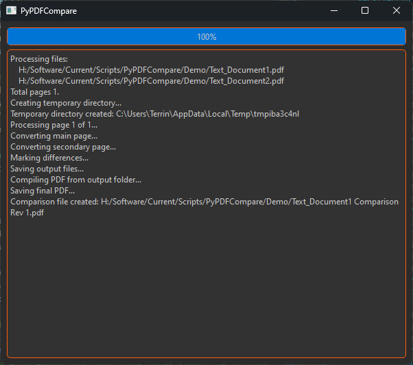
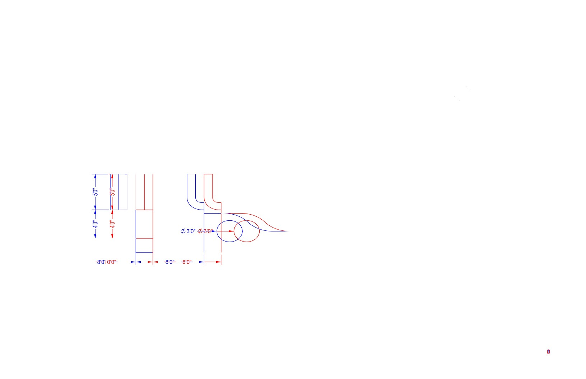

# PyPDFCompare

A python based command line PDF comparison tool.

## Description

`PyPDFCompare` is a command line tool for comparing PDF files. Currently, this tool works by comparing PDF files page by page in a raster based format. This then becomes a "pixel by pixel" comparison. This tool will then output 3 page types for each compared page:

1. Markup Page
2. Differences Page
3. Overlay Page

The markup page is the main page with outlines  around any changes and some boxes to highlight "larger changes".

The differences page is essentially the main page - the secondary page. Any changes that were "removed" since the previous version end up in red and anything that was "added" is in blue.

The overlay page is the secondary page in red with the main page slapped on top showing differences quite nicely in red.

Please see the `Demo` folder for more examples

## Limitations

Currently, this tool only supports comparing 2 PDF files at a time.

Due to the nature of a raster based comparison, any shift in lines or text and size changes also get captured as changes. In some cases this is useful, in others, it can just take away from any actual important changes. This mostly comes into play with text documents as when a word changes, all characters after it often shift (unless if using monspaced fonts). This functionality is being explored where text can be effectively compared and provide similar style outputs.

## Command-Line Options

Use `PyPDFCompare` followed by the options and file paths to compare **TWO** PDF files.

PyPDFCompare [options] FilePath1 FilePath2

### Options

- `-ps:pagesize`, `--page_size:pagesize`  
  Sets the page size for the comparison file.  
  **Default:** `AUTO`  
  **Options:** `AUTO`, `LETTER`, `ANSI_A`, `ANSI_B`, `ANSI_C`, `ANSI_D`  
  Example: `-ps:AUTO`

- `-dpi:level`  
  Sets the DPI (dots per inch) or quality level for the comparison file.  
  **Default:** `600`  
  Example: `-dpi:600`

- `-o:path`, `--output:path`  
  Sets the output path for the comparison file.  
  **Default:** None (Source Path)  
  Example: `-o:"~\\Desktop\\My Path"`

- `-s:bool`, `--scale:bool`  
  Scales the files to the same size before comparison.  
  **Default:** `True`  
  Example: `-s:True`

- `-bw:bool`, `--black_white:bool`  
  Sets the comparison file to be black and white to lower the file size.  
  **Default:** `False`  
  Example: `-bw:False`

- `-gs:bool`, `--grayscale:bool`  
  Sets the comparison file to be grayscale (includes shades between black and white) to lower the file size.  
  **Default:** `False`  
  Example: `-gs:False`

- `-r:bool`, `--reduce_filesize:bool`  
  Reduces the file size but also reduces overall quality.  
  **Default:** `True`  
  Example: `-r:True`

- `-mp:page`, `--main_page:page`  
  Sets the main focus page to either the newer or older document.  
  **Default:** `NEW`  
  **Options:** `NEW`, `OLD`  
  Example: `-mp:NEW`
